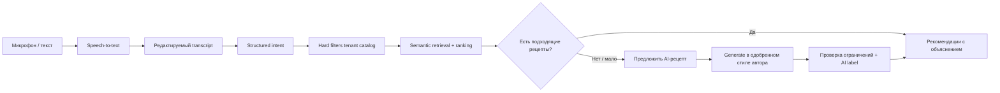

# White Povar: аудит обновлённого дизайна и roadmap white-label продукта

Дата аудита: 14 июля 2026; актуализирован 15 июля 2026
Область аудита: Flutter-приложение в `frontend/`, FastAPI backend, production web-сборка и обновлённый handoff в `White povar redesign brief document/`.

Актуализация: документ синхронизирован с handoff v1.2 от 15.07.2026, включая Этап 12 «Персона блогера» и финализирующие спецификации 13a–13m. Ранее отмеченные 14 пробелов в дизайн-контракте закрыты; ниже отдельно отмечены оставшиеся продуктовые и релизные решения.

## 1. Резюме

Текущая версия — рабочий consumer-прототип каталога рецептов, но ещё не полноценный white-label продукт для кулинарного автора.

Главный вывод: начинать попиксельное обновление отдельных экранов до создания white-label-фундамента нельзя. Иначе бренд, тема, тексты и tenant scope снова окажутся зашиты в экраны, а каждое новое приложение блогера превратится в отдельный fork.

Правильная последовательность:

1. Исправить конфигурацию tenant/блогера и сделать её источником бренда, темы и feature flags.
2. Перенести новый design system в переиспользуемые Flutter-компоненты.
3. Довести до handoff все существующие mobile-потоки и состояния.
4. Реализовать предусмотренные handoff desktop/tablet-композиции.
5. После design parity закрыть продуктовый core: tenant-safe каталог, сохранения, история, cooking progress, аналитика, офлайн и локализация.
6. Добавить коммерческий контур: продукты, цены, entitlements, покупки, restore/refund и кабинет автора.
7. Добавить голосовой intent и рекомендации из каталога; AI-генерацию в стиле автора использовать как контролируемый fallback.

### Критические проблемы, которые уже видны

- Production endpoint конфигурации автора `/recipes/chef/{chef_id}/config` возвращает 500: API ожидает `app_name`, `logo_url`, `theme_config`, которых нет в текущей таблице `chefs`.
- В приложении захардкожены `White Povar`, цвета и часть текстов; frontend не загружает chef config.
- Новый `BrandConfig` из handoff отсутствует целиком: нет `brand.voice`, curated font preset, `heroPhotos`, вычисляемых `accentPressed`/`accentOnDark` и валидации CTA-контраста.
- Существующий backend `ThemeConfig` разрешает произвольные primary/secondary/background/text/font. Это противоречит v1.2, где блогер меняет только accent и curated display preset, а neutral surfaces и системные состояния зафиксированы.
- `chef_id` во многих read/search запросах опционален и приходит от клиента. Для white-label это риск смешивания каталогов разных авторов.
- Новый handoff содержит полноценные premium/paywall состояния, но покупок, plans, receipt validation, restore и единого entitlement-сервиса нет.
- Premium-рецепты исключаются из части каталогов, поэтому пользователь не видит продающий teaser.
- UI сохранений есть, но кнопки bookmark на основных карточках не подключены к mutation; нормально наполнить «Збережені» нельзя.
- Камера технически проходит capture → review → results, но результаты основаны на простом пересечении строк, а low-confidence ингредиенты автоматически считаются подтверждёнными.
- Голосового сценария нет; web-заголовок сейчас явно запрещает микрофон: `microphone=()`.
- Mobile Home частично похож на новый дизайн, остальные ключевые экраны и почти весь desktop сильно расходятся с handoff.
- Production-контент смешивает английские данные с украинским интерфейсом, а фильтры cuisine/category пусты.

## 2. Что уже реализовано и что можно переиспользовать

Существующую архитектуру не нужно выбрасывать. Уже есть полезный каркас:

- Flutter + Riverpod + GoRouter, responsive shell с bottom navigation и NavigationRail.
- Авторизация email/password, Google и Apple на поддерживаемых платформах.
- Каталог, базовый поиск, detail, cooking mode, saved, profile, settings.
- Camera flow с выбором изображения, распознаванием, редактированием списка ингредиентов и результатами.
- Backend-модели recipes/ingredients/instructions/subscriptions и RLS-миграции.
- Backend search endpoints для advanced search, filters и suggestions, которые frontend пока не использует.
- Backend AI endpoints для substitutions, cooking tips, nutrition, improvements и suggestions, которые почти не представлены в UI.
- Premium access checks на detail endpoint и базовый subscription status.
- Flutter static analysis без ошибок и 9 проходящих frontend-тестов.

Именно эти части стоит развивать, а не создавать вторую параллельную реализацию.

## 3. Gap-анализ дизайна

Приоритеты:

- **P0** — блокирует white-label, корректность основного потока или продажу.
- **P1** — обязательно для design parity и продуктовой beta.
- **P2** — важно после основного mobile-потока.
- **P3** — улучшение после запуска.

### 3.1. Design system и персонализация

| Область | Сейчас | Новый handoff / требование | Gap | Приоритет |
|---|---|---|---|---|
| Бренд | `White Povar` и WP зашиты в конфиг/экраны | Level 2 persona через `BrandConfig` | Нет runtime brand layer и build-time identity | P0 |
| Цвета | Light tokens частично есть, dark во многом literals | Общие neutral tokens + брендовые `accent`/`accentOnDark` | Нет разделения system tokens и brand tokens; часть light-цветов используется в dark UI | P0 |
| Типографика | Системный шрифт | Figtree UI, JetBrains Mono data + одна из трёх curated display-пар | Нет font preset и bundled brand fonts | P1 |
| Компоненты | На экранах есть приватные дубли карточек/chips | Единые buttons, fields, cards, badges, state views | Поведение и размеры расходятся между экранами | P1 |
| Тема | По умолчанию dark, переключение только в памяти | System/light/dark с сохранением | Выбор теряется после перезапуска | P1 |
| Лого и assets | Статичный WP | `brand.name/avatar/logo/heroPhotos`, app icon и splash | Нет configurable asset pipeline, image contract и fallback правил | P0 |
| Локализация | Украинский UI + английский контент, часть строк inline | Единый язык приложения и контента | Нет полноценного i18n-контракта и content locale | P0 |
| Accessibility | Не зафиксирована | Контраст, semantics, tap targets, text scale, reduced motion | Нет системной проверки | P1 |

Целевые базовые system tokens из handoff:

- Dark: background `#16130F`, surface `#221D16`, surface strong `#2E2820`, text `#F3E9DA`, secondary `#B9AC98`, accent `#D9A441`.
- Light: background `#F5EEE1`, surface `#FDF8EE`, surface strong `#EBE0CC`, text `#1C1710`, secondary `#7C7159`, accent `#A87B24`.
- Spacing: 4/8/12/16/24/32/40/56.
- Radius: chips 8, buttons 12–14, cards 16–18, sheets 24–28.

Золото выше — default demo brand Chef's Table, а не обязательный цвет каждого tenant. Handoff v1.2 показывает три референса: Chef's Table (`#D9A441`, Source Serif 4), «Зелена миска» (`#3F7D52`, Golos Text) и «Солодка субота» (`#A64869`, Lora). При этом premium-золото, success/warning/error и нейтральные поверхности остаются системными и не перекрашиваются блогером.

Правило `onAccent` теперь определено: если accent-fill не проходит AA в светлой теме, CTA становится ink (`#1C1710`) с акцентной иконкой; в тёмных сценах используется автоматически осветлённый `accentOnDark`. Решение должно вычисляться при валидации конфигурации, а не на каждом render.

#### Границы персонализации v1.2

Handoff сознательно выбирает Level 2: лицо и голос блогера появляются в ключевых точках, но не конкурируют с едой и утилитарным UI.

Персонализируются ровно пять носителей:

1. Brand header: avatar + название блога.
2. Greeting/voice: одна короткая фраза и curated display font.
3. Accent: CTA, активная вкладка, chips и links с contrast gate.
4. Фирменные фотографии: Home hero/fallback и login background.
5. Course/paywall/login: promo-card, портрет, заголовок-приглашение и название курса.

Остаются системными: routes и навигационная структура, recipe cards, Search, camera content/steps, loading/empty/error, spacing/radius/motion, premium-золото, success/warning/error. Это важное ограничение: не надо добавлять имя, аватар или «выбор блогера» на каждую карточку рецепта.

### 3.2. Навигация и responsive shell

Сейчас все основные маршруты вложены в один `ShellRoute`; навигация скрывается только для camera и recipe. В результате settings и subscription продолжают показывать bottom navigation/rail, хотя handoff трактует их как отдельные экраны.

Что изменить:

- Оставить в 4-tab shell только Home, Search, Saved, Profile.
- Вынести recipe detail, cooking, camera, subscription, settings и auth в отдельные route branches.
- Сохранить состояние каждой вкладки при переключении.
- Для `>=600` реализовать tablet layouts с max content width около 480 и 3-column search grid.
- Для `>=1024` реализовать не просто rail вокруг мобильной колонки, а отдельные desktop-композиции из секции 9 handoff.
- Добавить deep links на рецепт, продукт, курс/меню и промокампанию автора.

### 3.3. Экранная матрица

#### Home — частично реализован, P0/P1

Что уже близко: шапка, заголовок, scan banner, категории, featured и compact cards.

Что обновить:

- Реализовать header 12a: `brand.avatar`, `brand.name` и `brand.voice.greeting` вместо generic WP header.
- Выбирать curated display font из `brand.font`; UI/body оставлять на Figtree.
- Применять `brand.accent` только через валидированные semantic tokens.
- Добавить компактную course promo-card с avatar, `brand.voice.courseName` и CTA; до появления course route CTA может вести на существующий `/subscription`.
- Сделать category chips интерактивными и открывать Search с установленным фильтром.
- Не назначать первый рецепт «рекомендованным»: использовать `isFeatured` и явный fallback.
- Подключить bookmark к favorites mutation и отобразить optimistic state.
- Исправить горизонтальный overflow chips и локализацию контента.
- Привести skeleton к структуре реального экрана; сейчас header фактически дублируется.
- Сохранить header и scanner в error state, заменяя только content region.
- Реализовать light-вариант 4d, включая его отличающуюся композицию.
- На desktop собрать 9a: top bar, global search, горизонтальный hero и 4-column grid.

#### Discover/Search — базовая версия, P0/P1

Сейчас есть только поле и набор быстрых query-chip; поиск запускается почти на каждый ввод, без debounce/cancellation.

Нужно:

- Стартовое состояние: suggestions, recent queries и category shortcuts.
- Debounce, отмена предыдущего запроса и защита от stale results.
- Подключить существующие backend endpoints `/suggestions`, `/filters`, `/advanced`.
- Bottom sheet фильтров: cuisine, category, difficulty, time, tags/featured и dietary ограничения.
- Активные filter chips, reset, result count.
- Mobile 2-column grid, tablet/desktop 3-column grid.
- Отдельные loading, error и no-results состояния 5c/5d.
- Desktop 9b: постоянная панель фильтров и master-detail/preview.
- Все фильтры должны быть tenant-scoped и формироваться из реальных данных автора.

#### Recipe detail — сильно расходится, P0/P1

Сейчас контент располагается под изображением; stats в узком dark layout становятся большими светлыми вертикальными блоками. Premium teaser, save/share и immersive header отсутствуют.

Нужно:

- Immersive hero image с back/save/share поверх blur-контролов.
- Badge/title overlay, компактный meta row, описание, ingredients rows и steps preview.
- Sticky действия «Зберегти» и «Готувати».
- Share/deep link с attribution конкретному блогеру.
- Guest и premium gate 6b: preview остаётся видимым, закрытый контент размыт, CTA ведёт в auth/paywall.
- Не отдавать закрытые instructions клиенту до проверки entitlement.
- Desktop 9c: фото слева, прокручиваемый контент справа, sticky action.
- Сохранить Recipe Detail нейтральным по Level 2: не добавлять avatar/name автора на экран или каждую карточку. Attribution остаётся в share/deep-link metadata, а связанные коммерческие предложения показываются только контекстно.

#### Cooking mode — только минимальный stepper, P1

Нужно:

- Полноэкранный режим без общей навигации.
- Номер шага, общий progress, крупный текст, media, chef tip.
- Несколько параллельных таймеров, background notification и восстановление после перезапуска.
- Screen awake, масштаб текста и hands-free next/back.
- Exit confirmation и сохранение cooking progress.
- Completion state 6d, история приготовления и CTA домой/к похожим рецептам.
- Desktop 9g с step rail и keyboard controls.

В handoff completion содержит звёздочный рейтинг, но текущая продуктовая модель и прежний brief рейтинги не предусматривают. Рекомендация для первой версии: заменить звёзды на приватный feedback «сподобалось / не сподобалось» для рекомендаций или убрать блок до появления осознанной rating-модели.

#### Camera ingredient flow — каркас есть, визуально и функционально неполный, P1

Нужно:

- Сохранить камеру всегда тёмной независимо от темы.
- Не добавлять в camera flow портрет, greeting или авторский copy: его layout, steps и states остаются системными; только общий валидированный accent token может влиять на controls.
- Live viewfinder, guidance overlay, flash, gallery, capture и manual input.
- Analyzing overlay поверх снимка с промежуточным статусом и понятным retry.
- Low confidence `<60%` не считать подтверждённым автоматически; показать dashed warning и запросить подтверждение.
- Переиспользовать review chips/редактор и для voice intent.
- Результаты ранжировать по tenant catalog, ingredient coverage, ограничениям и популярности.
- Показывать match percentage, использованные и недостающие ингредиенты, а не только exact set intersection.
- Выделять top 100% match и показывать остальные compact cards.
- Добавить camera permission states, offline/timeout и обработку privacy.
- Desktop 9d: upload/dropzone + side-by-side review.

#### Saved — есть состояния, нет полноценного входа в поток, P0/P1

Нужно:

- Подключить save/unsave на Home, Search и Detail.
- Optimistic update с rollback; remove + undo.
- Category/filter chips и compact list из 10a.
- Развести saved recipes, purchased content и cooking history.
- Guest state с «Увійти» и «Створити акаунт».
- Решить, переносятся ли локальные guest saves в аккаунт после регистрации.

#### Profile — только базовые auth states, P1

Нужно:

- Нейтральный guest state 8b с login и create account; полная persona-сцена появляется уже на Login 12e.
- Для пользователя: avatar/initial, subscription badge, saved/cooked/scans stats.
- Saved, history, purchases/subscription, settings, logout.
- Удаление аккаунта, экспорт/удаление данных и подтверждение logout.
- Desktop master-detail 9e.

Показывать stats можно только после появления надёжных событий/агрегаций; сейчас frontend не располагает такими данными.

#### Auth — функциональный, но не по handoff, P0/P1

Нужно:

- Реализовать 12e: всегда тёмная сцена, `brand.heroPhotos` как background, avatar 72 px, `brand.name` и `brand.voice.loginTitle`.
- Использовать `accentOnDark` для акцентных действий; поля, validation, Google/Apple и guest-вход остаются общей системой 8e.
- Forgot password: service уже существует, но активный экран его не использует.
- Email/password, Google, Apple по платформе, sign up и continue as guest.
- Корректный возврат на исходный gated content после входа.
- Terms/privacy ссылки конкретного tenant.
- Account linking и понятные ошибки provider collision.

#### Subscription/Paywall — status screen вместо commerce, P0

Сейчас экран умеет показать статус и features, но guest получает raw `Not authenticated`; реального выбора плана и покупки нет.

Нужно:

- Guest paywall должен загружаться без запроса auth-only status.
- Реализовать 12b как всегда тёмную сцену: portrait автора, `brand.voice.paywallTitle`, подпись и название курса; benefits/layout остаются общими.
- Monthly/annual планы и trial показывать только если они реально сконфигурированы.
- Purchase, restore, manage subscription, grace period, billing retry, cancellation/refund states.
- Content-specific offers: один рецепт, меню/pack, курс и подписка.
- Единый entitlement service, а не только `recipe.is_premium`.
- Paywall source/offer tracking и удалённая конфигурация текста/цен.
- Desktop 9f.

#### Settings — минимальный экран, P1/P2

Нужно:

- Persisted system/light/dark theme.
- Язык, единицы измерения и регион.
- Notification preferences: recipe of the day, new recipes/products, timers.
- Help/support автора, privacy, terms, purchase management, app version.
- Privacy controls для фото, аудио, AI history и персонализации.

#### Logo/assets — BrandConfig появился, но asset pipeline ещё отсутствует, P0

Новый handoff уже показывает три разных бренда. Теперь эти варианты нужно превратить в исполнимый контракт:

- Определить slots для monogram, wordmark, avatar и fallback initials.
- Зафиксировать safe area, минимальные размеры, light/dark variants.
- Автоматизировать app icon, splash, favicon и web manifest для каждого build flavor.
- Для `heroPhotos` определить aspect ratios, focal point/crop, minimum resolution, dark overlay и bundled fallback.
- Не позволять произвольному accent нарушать контраст: валидировать конфигурацию заранее и сохранять вычисленные `accentPressed`, `accentOnDark` и CTA mode.

### 3.4. Desktop — отдельный крупный gap

Текущая desktop-версия в основном растягивает mobile feed рядом с NavigationRail. Handoff описывает семь отдельных desktop-композиций: Home, Discover, Detail, Camera, Profile/Settings, Paywall и Cooking.

Это не responsive polish, а отдельный этап реализации. До его начала надо создать shared responsive primitives: breakpoint service, content constraints, adaptive grids, master-detail shell, adaptive modal/dialog и keyboard/focus navigation.

### 3.5. Карта основных технических точек изменения

| Файл/область | Что обнаружено | Основное изменение |
|---|---|---|
| `frontend/lib/core/config/app_config.dart` | Статичный `appName` | Разделить bundled build identity и загружаемый `BrandConfig`/product config |
| `frontend/lib/app/theme/tokens/app_tokens.dart` | Неполный набор light tokens | Разделить shared system tokens и `BrandTokens` (`accent`, derived states) |
| `frontend/lib/app/theme/app_theme.dart` | Dark theme собрана literals | Строить ThemeData из shared neutrals + валидированного BrandConfig; подключить curated fonts |
| `frontend/lib/app/router/app_router.dart` | Почти все маршруты находятся в одном shell | Развести tab shell и full-screen flows; добавить deep-link redirects |
| `frontend/lib/features/home/presentation/pages/home_page.dart` | Hardcoded filters/brand, первый рецепт считается featured, bookmark inert | Реализовать 12a header/course card, real facets/featured и favorites mutation; вынести дубли в shared UI |
| `frontend/lib/features/search/presentation/pages/search_page.dart` | Простой query UI, нет debounce/advanced filters | Подключить suggestions/filters/advanced, cancellation и adaptive grids |
| `frontend/lib/features/recipes/presentation/pages/recipe_detail_page.dart` | Старый layout, нет save/share/gate | Реализовать 6a/6b/9c и server-safe premium preview |
| `frontend/lib/features/recipes/presentation/pages/cooking_mode_page.dart` | Только базовое переключение шагов | Cooking session state, timers, wake lock, resume и completion |
| `frontend/lib/features/camera/` | Хороший каркас потока, слабая confidence/ranking логика | Сохранить flow, обновить компоненты и вынести ingredient intent model |
| `frontend/lib/features/saved/` | Read state есть, входные save-actions не подключены | Единый favorites repository + optimistic mutations/undo |
| `frontend/lib/features/auth/presentation/pages/login_page.dart` | Auth работает, handoff/forgot/guest return отсутствуют | Реализовать dark 12e из BrandConfig, reset flow и redirect к gated content |
| `frontend/lib/features/subscription/` | Status/features без реального checkout | Реализовать dark 12b + offers/entitlements + platform purchase adapters |
| `frontend/lib/features/profile/presentation/pages/settings_page.dart` | Только минимальная тема | Persistence, notifications, locale/units, legal/privacy |
| `frontend/pubspec.yaml` | Нет шрифтов handoff; Hive фактически не используется | Добавить font assets; определить минимальный offline cache scope |
| `backend/app/schemas/chef.py` + `database_schema.sql` | API schema, новый BrandConfig и таблица `chefs` не совпадают | Отдельная versioned config table/DTO с точным BrandConfig; product config хранить отдельно |
| `backend/app/api/v1/endpoints/recipes.py` | `chef_id` optional; free list отбрасывает premium | Trusted tenant dependency; вернуть безопасные premium teaser DTO |
| `backend/app/api/v1/endpoints/search.py` | Tenant приходит от клиента; frontend не использует возможности API | Tenant dependency, facet integrity, единый ranking contract |
| `backend/app/services/ai_service.py` | Общий образ «master chef» | Tenant-scoped retrieval и approved creator style profile |
| `backend/app/services/subscription_service.py` | Subscription tier не покрывает продукты автора | Универсальные products/offers/entitlements/receipts |
| `render.yaml` | `microphone=()` | Сохранять запрет до voice-релиза; затем разрешить `self` вместе с privacy UX |

Дополнительно стоит унифицировать HTTP-клиент и модели frontend: recipes используют отдельный `http`-слой, тогда как другие features уже используют Dio. Это не P0 редизайна, но уменьшит дублирование auth/error/retry/cache логики перед добавлением новых API.

## 4. White-label архитектура

### 4.1. Рекомендуемая модель продукта

Один код и один backend, но отдельное consumer-приложение/домен на автора:

- Mobile: tenant ID фиксируется build flavor/environment; app name, bundle ID, icon, splash и store metadata собираются для автора.
- Web: tenant определяется по проверенному hostname/custom domain.
- Backend: tenant вычисляется из доверенного app installation/client ID/hostname, а не принимается как произвольный `chef_id` из query.
- Внутри consumer-приложения не нужен выбор блогера: пользователь уже находится в приложении конкретного автора.

Это сохраняет white-label обещание и не превращает продукт в marketplace авторов.

### 4.2. Что относится к build-time, а что к runtime

**Build-time identity:**

- App name, package/bundle ID.
- App icon, splash, favicon, web manifest.
- Deep-link domain и store listing.
- Firebase/Supabase client configuration.
- Default locale, legal entity и store products.

`brand.logo` из remote config можно использовать внутри приложения, но он не может надёжно заменить установленную mobile app icon или native splash после публикации. Поэтому icon/splash остаются build-time assets, даже если handoff перечисляет их рядом с `brand.logo`.

**Runtime `BrandConfig` из handoff v1.2:**

- Brand name, logo и avatar.
- Один accent, curated display-font preset и brand photos.
- Четыре коротких voice strings для Home, Paywall, Login и course card.
- Вычисленные accent states и CTA contrast mode.

**Runtime product/tenant config вне design layer:**

- Support/social/legal links и locale/units.
- Feature flags: camera, voice, AI generation, courses, purchases.
- Catalog rules, offers/product IDs и paywall availability.
- AI persona/style profile и safety rules.
- Analytics dimensions без передачи данных между tenant.

Brand и product config лучше не смешивать: первый управляет только Level 2 persona, второй — доступностью функций, commerce и бизнес-правилами.

### 4.3. Целевой контракт конфигурации

```text
TenantBootstrap
  tenant_id, slug, status, config_version
  brand
    name, creator_name, avatar_url
    accent
    voice {greeting, login_title, paywall_title, course_name?}
    course_tag?
    font_preset?: serif | grotesque | humanist
    hero_photos[]? {url, focal_point, alt?}
    logo_url?
    derived {accent_pressed, accent_on_dark, cta_mode}
  product
  locale {default, supported, units, timezone}
  links {website, social, support, privacy, terms}
  features {camera, voice, ai_generation, subscriptions, one_offs, courses}
  commerce {platform_product_ids, default_offer, currency}
  ai_profile {approved_style_summary, retrieval_sources, blocked_claims}
  content_settings {home_modules, free_preview_policy}
```

Backend должен отдавать конфиг до построения `MaterialApp`, frontend — валидировать, кэшировать последнюю корректную версию и запускаться с безопасным bundled fallback при временной недоступности сети.

Новые поля не требуются в `recipe.dart`: persona остаётся tenant-level контекстом. Новые commerce/course routes появятся только на продуктовом этапе и не должны блокировать design parity 12a–12e.

### 4.4. Статус handoff v1.2 и оставшиеся решения

Спецификации 13a–13m закрывают прежние пробелы: обязательность и лимиты `BrandConfig`, `creatorName`, четыре voice-строки, derived accent tokens и contrast gate, curated fonts с кириллицей, media contract/focal point/fallback, light/dark и responsive variants, состояния login/paywall, различие blogger/user avatar, шаблоны assets и Creator Studio preview/validation.

Handoff персонализации готов к реализации. До production-релиза остаётся уточнить:

1. Разделить runtime publish и build-time release: конфиг может обновиться сразу, но app icon/native splash требуют новой mobile-сборки и публикации в store. В Studio нужны независимые статусы config/web/mobile build/release.
2. В каждую tenant-сборку включать последний утверждённый `BrandConfig`. Generic `White Povar` допустим только для внутренней/unconfigured сборки, а не как first-start fallback брендового приложения.
3. Сделать `courseName` и `courseTag` условно обязательной парой либо скрывать карточку; отдельно определить роли фотографий (`login`, `paywall`, `course`) вместо неявного использования `heroPhotos[0]`.
4. Зафиксировать reference implementation OKLCH: что означает `-12%` lightness, как выполняются gamut clamp и округление.
5. Разнести paywall loading и error в разные макеты; добавить store products unavailable/loading, trial-ineligible, user-cancelled purchase, grace/billing-retry/expired/cancelled subscription.
6. Добавить signup, account linking и provider-collision состояния для login.
7. Зафиксировать локализацию brand voice/course strings или явно ограничить MVP одним языком.
8. Не называть tagged premium recipe collection полноценным курсом. Реальный курс потребует modules/lessons/progress; menu, course и отдельная покупка требуют собственных products/entitlements, которых в текущем handoff ещё нет.
9. Для Creator Studio добавить draft/unsaved changes, publish result, version history/rollback, роли доступа и состояние неуспешной генерации assets/build.
10. Отдельно спроектировать продуктовые сценарии вне текущей персонализации: voice intent → transcript/edit → catalog recommendations → no-match → opt-in AI generation в стиле автора.

### 4.5. Tenant isolation — обязательный security gate

- Все recipes/search/featured/suggestions/filter facets должны автоматически фильтроваться по trusted tenant context.
- `chef_id` пользователя не должен давать право читать/изменять чужой tenant.
- Entitlements всегда содержат tenant и product/content scope.
- Storage paths, analytics events и AI retrieval должны содержать tenant boundary.
- Добавить интеграционные тесты: два tenant, одинаковые названия рецептов, отсутствие cross-tenant results в list/search/detail/favorites/AI.
- Любые client-supplied tenant IDs сверять с server-resolved tenant.

## 5. Функциональные gaps до полноценного продукта

### 5.1. Consumer core

| Возможность | Текущее состояние | Что требуется |
|---|---|---|
| Каталог | Базовый list/featured | Editorial sections, free/premium teaser, tenant scope, pagination |
| Поиск | Простой text query | Facets, suggestions, intent, typo tolerance, ranking, no-results recovery |
| Saved | Provider и экран есть | Действующие buttons, sync, guest migration, undo |
| История | Практически нет | Viewed/cooked history и resume |
| Cooking | Только step navigation | Timers, progress, completion, wake lock, accessibility |
| Preferences | Нет | Diet, allergens, dislikes, cooking time, equipment, household |
| Pantry | Нет | Manual/camera/voice ingredients, quantity/freshness optional |
| Shopping list | Нет | Missing ingredients, grouping, share/export, purchased toggle |
| Offline | Hive инициализирован, но не используется | Saved recipe + active cooking offline, sync policy |
| Notifications | Нет | New content, campaigns, timer alerts, opt-in preferences |
| Localization | Неполная | UI + content locale + units + pluralization |
| Analytics | Flags есть, событий нет | Product funnel, creator dashboard, privacy/consent |

### 5.2. Контентные продукты автора

Модель `is_premium` на рецепте недостаточна. Автор продаёт разные типы ценности:

- Отдельный рецепт.
- Набор/коллекция рецептов.
- Меню на неделю/праздник/цель.
- Курс с модулями, уроками, видео и progress.
- Подписка на premium-каталог.
- Бесплатный лид-магнит или trial collection.

Нужен универсальный catalog + entitlement слой:

```text
Product -> Price/Offer -> ProductContent -> Entitlement
        -> Order/Receipt -> Refund -> CreatorLedger/Payout
```

Основные сущности: `products`, `prices/offers`, `product_content`, `orders`, `purchase_receipts`, `subscriptions`, `entitlements`, `refunds`, `creator_ledger`, `payouts`. Для курсов дополнительно: `courses`, `modules`, `lessons`, `lesson_assets`, `user_progress`.

### 5.3. Creator Studio — отсутствующий второй контур продукта

Без кабинета автора white-label решение нельзя масштабировать операционно. Минимальный studio должен позволять:

- Создать tenant и пройти onboarding бренда.
- Настроить theme/logo/links/locale/features и preview light/dark/mobile/desktop.
- Импортировать рецепт из формы, файла или URL; отредактировать ингредиенты, шаги, media, SEO и allergens.
- Управлять draft/review/scheduled/published/archived.
- Помечать free/teaser/paid и связывать контент с products.
- Создавать menu/collection/course и задавать порядок контента.
- Настроить prices/offers/platform product IDs.
- Определить AI style profile на основании одобренных материалов автора.
- Смотреть funnel: views → saves → cook starts → completions → paywall → purchase.
- Видеть revenue, refunds и payouts.
- Управлять редакторами/командой через роли Owner, Editor, Analyst, Support.

Для первого коммерческого пилота studio может быть admin-only, но его data model и API не следует откладывать: ручное редактирование production database быстро станет главным операционным риском.

## 6. Голосовой запрос и AI-рекомендации

### 6.1. Целевой пользовательский поток

Пример: «Хочу щось легке на вечір із курки, до 30 хвилин» или «Романтична вечеря з риби; у мене є лосось, шпинат і лимон».



### 6.2. Structured intent

LLM не должен сразу писать рецепт. Сначала он преобразует речь в проверяемую структуру:

- Occasion/mood: вечер, романтический ужин, дети, гости.
- Ingredients available и excluded.
- Dish type/course.
- Time limit и difficulty.
- Dietary rules, allergens и dislikes.
- Cuisine/style.
- Servings.
- Equipment.
- Desired properties: лёгкое, белковое, праздничное и т.д.

Пользователь видит и может поправить распознанные chips до поиска. Для этого следует переиспользовать существующий ingredient review component камеры.

### 6.3. Ranking внутри базы автора

Порядок отбора:

1. Tenant boundary и entitlement visibility.
2. Жёсткие ограничения: allergens/diet, excluded ingredients, доступное оборудование.
3. Ingredient coverage и missing ingredient cost.
4. Semantic match к occasion/mood/dish type.
5. Time/difficulty fit.
6. Editorial boost автора, quality и popularity.
7. Персональные сигналы: saves, cooked, feedback, dislikes.

Каждая рекомендация должна объяснять «чому підійде»: например, «25 хвилин, використовує 4 з 5 ваших продуктів, легка вечеря».

### 6.4. AI generation как fallback, а не основной каталог

Генерацию предлагать только после ответа базы: «У каталозі автора немає точного збігу. Створити новий варіант у його кулінарному стилі?»

Требования:

- Использовать retrieval по одобренным рецептам/текстам и отдельный creator-approved style profile.
- Не утверждать, что конкретный AI-рецепт лично создан или одобрен блогером.
- Всегда маркировать generated content.
- Проверять allergens, внутреннюю согласованность quantity/steps/time и food safety.
- Не публиковать generated recipe в общий каталог автоматически; по умолчанию это приватный user artifact.
- Дать save/regenerate/adjust и feedback.
- Ввести rate/cost limits и tenant budget.
- Не хранить исходное аудио по умолчанию; отдельно управлять transcript/history consent.

### 6.5. Технический vertical slice

- Client states: idle → permission → listening → transcribing → review intent → searching → results/no match → generating → result/error.
- API: `POST /recommendations/interpret`, `POST /recommendations/search`, `POST /ai/recipes/generate` либо один orchestration endpoint с явными этапами.
- Speech-to-text должен быть platform adapter: native mobile и web implementation.
- Для web при запуске функции изменить Permissions-Policy с `microphone=()` на минимально необходимое `microphone=(self)` и добавить permission/privacy UX.
- Сохранять intent и ranking reasons для аналитики, но не чувствительные raw audio данные.

## 7. Монетизация

### 7.1. Рекомендуемый MVP

Для пилота поддержать один универсальный entitlement backend, но ограничить UX тремя офферами:

1. Месячная/годовая подписка на premium-каталог.
2. Разовая покупка menu/collection.
3. Разовая покупка course.

Отдельный paid recipe можно хранить той же моделью, но не обязательно выводить как главный оффер до появления данных о спросе.

### 7.2. Каналы оплаты

- iOS/Android digital content: использовать платформенные purchase adapters и server-side receipt/webhook verification в соответствии с правилами конкретного storefront/program.
- Web: отдельный checkout adapter, например Stripe.
- Creator payouts: ledger должен отделять gross, taxes, store/payment fees, refunds и net; payout provider подключается поверх ledger.
- Entitlement service остаётся единым для всех каналов и обеспечивает restore на новом устройстве.

Актуальные правила различаются по storefront и программам, поэтому billing UX нужно проектировать после выбора стран запуска. Официальные источники: [Apple App Review Guidelines](https://developer.apple.com/app-store/review/guidelines/), [Google Play Payments policy](https://support.google.com/googleplay/android-developer/answer/9858738?hl=en), [Stripe Connect payouts](https://docs.stripe.com/connect/marketplace/tasks/payout).

### 7.3. Free-to-paid funnel

Базовый контент автора в соцсетях должен продолжать работать как acquisition:

- Deep link из соцсети открывает конкретный бесплатный рецепт.
- Пользователь может посмотреть и приготовить его без немедленного hard gate.
- Save/history требуют мягкого account prompt в подходящий момент.
- После value moment показывается контекстный teaser связанного меню/курса/premium collection.
- Paywall объясняет конкретную ценность автора, а не абстрактный список AI features.
- Покупка возвращает пользователя ровно к исходному контенту.

## 8. Приоритизированный план реализации

План разделён на design parity и последующий product build, как требуется. При этом white-label foundation входит в самый первый дизайн-этап, потому что все экраны зависят от него.

### Этап D0. Зафиксировать контракты дизайна и продукта — P0

- Принять handoff v1.2 и спецификации 13a–13m как source of truth для design parity.
- Формализовать runtime publish против build-time mobile release и bundled tenant fallback.
- Зафиксировать условную пару `courseName`/`courseTag`, роли `heroPhotos` и reference implementation OKLCH.
- Решить противоречие со звёздочным рейтингом.
- Определить обязательные/опциональные profile stats.
- Утвердить guest rules и какие экраны доступны без аккаунта.
- Зафиксировать tenant config schema и build-time/runtime split.
- Использовать три бренда из 13e как reference fixtures для реализации и visual tests.

**Выход:** согласованный design/token/tenant contract без неявных значений.

### Этап D1. White-label bootstrap и tenant security — P0

- Добавить versioned storage для точного `BrandConfig` и отдельного product config; исправить production chef config 500.
- Определять tenant из flavor/hostname/trusted client context.
- Включить tenant scope по умолчанию во все catalog/search/AI endpoints.
- Реализовать frontend bootstrap, validation, caching и fallback config.
- Вынести brand strings/assets из экранов только в разрешённых Level 2 точках; не распространять persona на recipe cards/Search/Camera states.
- Добавить tenant isolation integration tests.

**Выход:** одна кодовая база запускается с тремя reference BrandConfig из 12a, а данные tenant никогда не смешиваются.

### Этап D2. Design system и routing — P0/P1

- Подключить Figtree и три curated display preset; разделить system `ThemeExtension` и `BrandTokens`.
- Собрать shared Button, TextField, Chip, Badge, RecipeCard, StateView, Skeleton, Sheet, Header, BrandMark.
- Перестроить route branches и adaptive shell.
- Добавить persisted theme/system mode.
- Начать golden tests dark/light для Chef's Table, «Зелена миска» и «Солодка субота».

**Выход:** компоненты handoff доступны как единый UI kit; экраны больше не задают собственные цвета/размеры.

### Этап D3. Основной discovery funnel — P0/P1

- Home 12a + course promo + loading/error.
- Search start/results/filters/loading/no-results.
- Shared recipe cards + working save.
- Recipe detail + premium/guest teaser + share/deep link.
- Исправить featured logic и доступность premium teaser в listings.

**Выход:** пользователь находит, открывает и сохраняет free/premium teaser контент во всех состояниях.

### Этап D4. Cooking и ingredient discovery — P1

- Полный cooking mode и completion.
- Camera capture/analyzing/review/results/error.
- Ingredient-aware backend ranking и manual ingredient entry.
- Permissions, accessibility, resume и offline active recipe.

**Выход:** два главных value flows — «найти» и «приготовить» — завершены end-to-end.

### Этап D5. Account и commerce surfaces — P0/P1

- Saved populated/empty/guest.
- Profile authenticated/guest.
- Auth 12e/forgot password/return-to-content.
- Settings/privacy/legal.
- Paywall 12b default/active/error/restore states; пока можно подключить sandbox purchase adapter.

**Выход:** все mobile-экраны 4–8, 10–12 соответствуют handoff и связаны в цельные потоки.

### Этап D6. Tablet/desktop parity — P1/P2

- Реализовать 9a–9g как adaptive compositions.
- Keyboard, focus, pointer/hover, dialogs и desktop upload.
- Visual regression на 390, 600/768, 1024 и 1440.

**Выход:** desktop — полноценный интерфейс, а не растянутая mobile-колонка.

### Этап D7. Design release gate — P0/P1

- Golden/screenshot comparison dark/light для всех трёх reference BrandConfig.
- Accessibility audit, text scale 200%, contrast, screen reader labels.
- Loading/error/empty/offline/permission/guest/premium states на каждом критическом экране.
- Flutter analyze/test/build, backend tests в pinned Python 3.11 environment, smoke test production-like deployment.

**Выход:** design parity закрыта; только после этого начинается расширение продукта.

### Этап P1. Consumer product core

- Preferences/allergens/diet/equipment.
- Reliable saved, viewed/cooked history и cooking progress.
- Offline saved/current recipe.
- Shopping list из missing ingredients.
- Analytics taxonomy и consent.
- Content locale/units и data-quality pipeline.

### Этап P2. Commerce beta

- Product/offer/content/entitlement schema.
- Subscription + collection/course purchase adapters.
- Receipt/webhook verification, restore, refund, grace period.
- Branded remote-config paywall.
- Purchases library и access across devices.
- Creator ledger; payout integration после сверки store/web economics.

### Этап P3. Creator Studio MVP

- Tenant onboarding и brand preview.
- Recipe editor/import/publish workflow.
- Menu/collection/course builder.
- Product and offer management.
- Basic analytics and revenue dashboard.
- Roles/audit log.

### Этап P4. Voice recommendations MVP

- Microphone/text input, STT и transcript review.
- Structured intent chips.
- Tenant catalog hybrid retrieval/ranking и explanations.
- No-match recovery без генерации как первая версия.
- После quality benchmark — opt-in generated recipe fallback с AI label/safety checks.

### Этап P5. Growth и intelligence

- Персональный ranking на основании поведения и explicit preferences.
- Notifications/lifecycle campaigns и deep-link attribution.
- Pantry, meal planning и более умный shopping list.
- Creator content performance insights и AI-assisted editorial tooling.
- A/B tests paywall/offers в пределах platform policy.

## 9. P0 backlog до любого публичного пилота

| ID | Задача | Причина |
|---|---|---|
| P0-00 | Зафиксировать BrandConfig v1.2 и runtime/build publication contract | Исключить расхождение config publish, native assets и tenant fallback |
| P0-01 | Исправить chef config schema/endpoint | Персонализация production сейчас не загружается |
| P0-02 | Trusted tenant resolution + isolation tests | Риск показа чужого каталога |
| P0-03 | Dynamic brand/theme/bootstrap | Иначе редизайн снова будет hardcoded |
| P0-04 | Подключить save mutations | Один из основных retention flows не работает |
| P0-05 | Исправить premium discovery и guest paywall | Нельзя построить free-to-paid funnel |
| P0-06 | Унифицировать язык UI/контента и filter data | Текущий опыт выглядит незавершённым |
| P0-07 | Новый Detail gate без утечки premium content | Коммерческая и security корректность |
| P0-08 | Product/entitlement contract до billing UI | Исключить разрозненные проверки доступа |
| P0-09 | Analytics для core funnel | Без данных нельзя улучшать activation/revenue |
| P0-10 | Privacy/legal/account deletion basics | Обязательная готовность consumer-продукта |

## 10. Метрики продукта

Основная метрика должна измерять созданную ценность, а не только просмотры:

**North star:** завершённые cooking sessions на активного пользователя в неделю.

Обязательные события:

- Acquisition: app open, deep link open, campaign/source.
- Discovery: search submitted, filter applied, recommendation shown/clicked.
- Activation: recipe viewed, saved, cook started, first cook completed.
- Camera/voice: permission, capture/record, intent confirmed, results, no match, generation offered/completed.
- Retention: return, saved opened, repeat cook, notification open.
- Revenue: product viewed, paywall viewed, purchase started/completed/failed, restored, renewed, cancelled, refunded.
- Content quality: step completed, timer used, feedback, search with no results.
- Creator: publish, content performance, conversion and net revenue.

Во все события добавлять tenant, content/product ID, locale и platform; не отправлять raw voice/photo data как analytics properties.

## 11. Что осознанно не включать в первую версию

- Общий marketplace блогеров внутри consumer app.
- Социальную ленту, публичные комментарии и сложную community-модерацию.
- Автопубликацию AI-рецептов от имени автора.
- Полноценную grocery commerce/inventory интеграцию.
- Отдельный code fork для каждого блогера.
- Несколько параллельных billing backend без единого entitlement abstraction.
- Сложный nutrition/medical positioning до появления проверенных источников и legal review.

## 12. Техническая проверка текущего состояния

- `frontend/flutter analyze`: без замечаний.
- `frontend/flutter test`: 9 тестов прошли.
- `frontend/flutter build web`: успешно.
- Backend tests в локальном системном Python 3.13: 96 passed, 4 failed, 3 errors; ошибки связаны с несовместимой локальной связкой Starlette `TestClient`/httpx (`unexpected keyword argument app`). В репозитории версии pinned под Python 3.11, поэтому проверку надо повторять в том же environment, что CI/Render, и синхронизировать toolchain.
- Production smoke check 14.07.2026: каталог открывается, но chef config падает; filters не возвращают cuisine/category; featured endpoint пуст, хотя UI визуально выбирает первый рецепт как featured.

## 13. Definition of Done для полноценной beta

- Ни один consumer-экран не содержит обязательный hardcoded `White Povar` brand.
- Три reference BrandConfig из 12a отличаются accent/font/avatar/photos/voice, но используют один commit и общие system components.
- Persona остаётся на Level 2: на нейтральных Recipe/Search/Camera/state surfaces нет лишних avatar/name/badges автора.
- Cross-tenant list/search/detail/favorite/AI tests проходят.
- Все handoff screens и states реализованы на mobile; desktop 9a–9g проверены отдельно.
- Free recipe → save/cook → related paid offer → purchase → unlock → restore работает end-to-end.
- Camera возвращает объяснимые ingredient matches; voice intent возвращает catalog recommendations.
- Premium payload не раскрывается до entitlement check.
- Theme/language/preferences/cooking progress сохраняются.
- Core analytics funnel виден по каждому tenant.
- Accessibility, privacy, legal, account deletion и purchase management проходят release checklist.
- Analyze/tests/build/backend integration/smoke tests зелёные в pinned environments.

## 14. Решения, которые нужно принять владельцу продукта

Рекомендованные defaults указаны первыми:

1. **Одна branded app на одного автора** или multi-creator marketplace? Рекомендация: branded app; marketplace противоречит white-label позиционированию.
2. **Первая коммерческая линейка:** subscription + menu/course или все типы сразу? Рекомендация: subscription + collection/course, но универсальная entitlement model.
3. **AI generation:** сразу пользователям или после catalog recommendation benchmark? Рекомендация: сначала рекомендации, затем opt-in fallback.
4. **Рейтинг после готовки:** убрать/приватный feedback или публичные звёзды? Рекомендация: приватный feedback на первом этапе.
5. **Guest saves:** локально с последующим merge или только после auth? Рекомендация: локально + merge, чтобы не ломать acquisition flow.
6. **Первые страны/валюта/язык:** решение определит billing, legal, store configuration и localization scope.
7. **Courses в MVP:** native lessons/progress или gated external content? Рекомендация: native minimal course model, иначе продукт теряет контроль над completion и upsell данными.

---

Итоговая продуктовая формула: **branded каталог и cooking companion конкретного автора → бесплатная ценность и привычка готовить → персональные tenant-scoped рекомендации → контекстная продажа меню, курса или premium-доступа → аналитика и инструменты роста для автора**.
